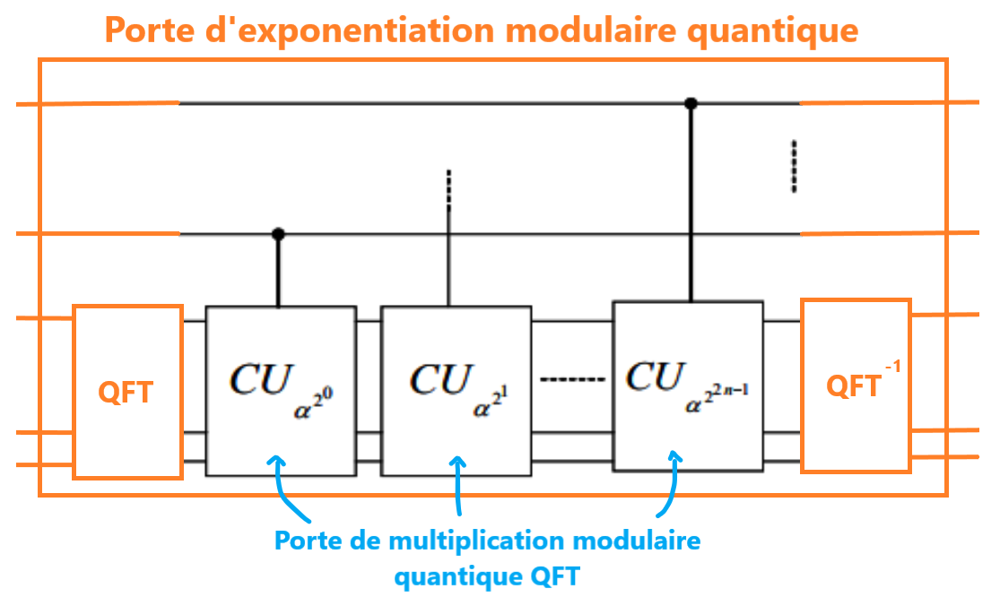
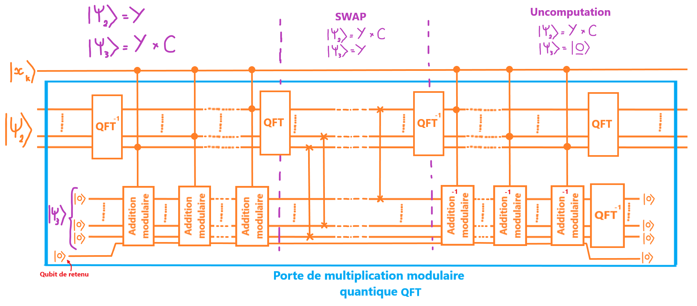
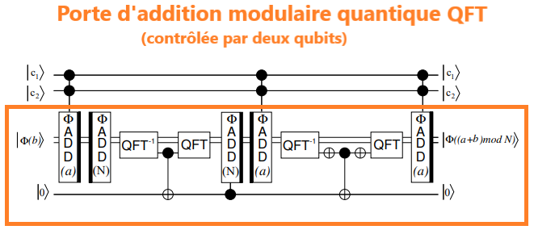
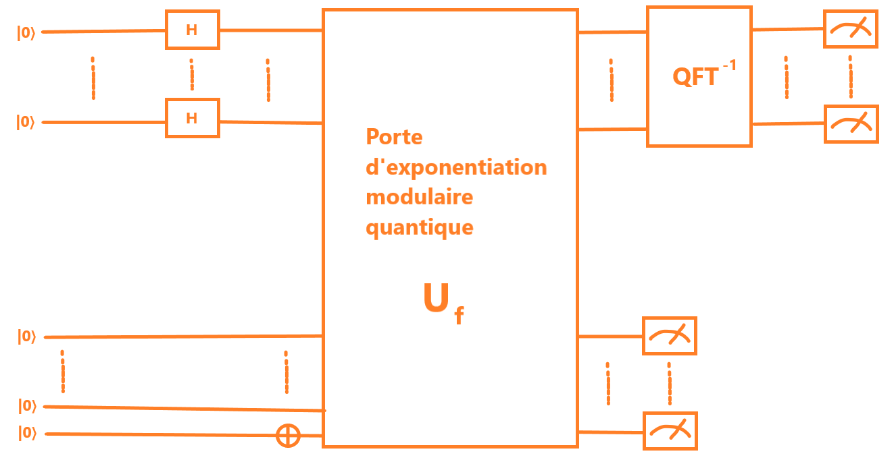

## Informations

Ce projet consiste à réaliser l'algorithme de Shor afin de déterminer les deux facteurs $p$ et $q$ d'un entier $N$ tel que $N = p*q$.

Bien que la partie quantique de l'algorithme de Shor ne soit que simulée à l'aide de matériel informatique (QDK), ce projet est avant tout destiné à aider à comprendre le fonctionnement de l'algorithme de Shor ainsi qu'à me familiariser avec le langage Q# et la logique quantique.

L'algorithme Q# simulé avec le QDK prend donc environ une minute pour factoriser 20 et autour de 5 à 10 minutes pour factoriser 35 (justifiant donc l'intérêt de faire tourner le programme sur un ordinateur quantique).

Comme j'ai pris un temps considérable à trouver toutes les informations pour comprendre l'algorithme de Shor, j'ai résumé le fonctionnement de l'algorithme ci-dessous en détail si vous souhaitez éviter de lire des dizaines de pages d'articles mathématiques ou scientifiques sur le sujet. Si vous souhaitez voir les détails, j'ai écrit à la fin les liens vers les différents articles que j'ai lus pour arriver à ces explications.

**Comment lire un circuit quantique (infos pour ceux qui ne savent pas):**

Les lignes horizontales correspondent aux qubits ; le circuit se lit de gauche à droite.
Les portes quantiques sont représentées sous forme de rectangles.
Certaines portes quantiques sont en réalité composées de plusieurs autres portes quantiques (ce qui est le cas ici avec certaines portes, comme, par exemple, la porte unitaire d'exponentiation modulaire).
Certaines portes sont dites « contrôlées » : elles ne s'activent que si le ou les qubits appelés qubits contrôleurs sont dans l'état $|1⟩$.
Un qubit contrôleur est représenté comme un point noir, tandis que le qubit cible est représenté comme un cercle noir creux contenant une croix.
Lorsqu'un qubit contrôleur est connecté par un trait à un qubit cible, on applique une porte $CNOT$ (qui est en fait une porte Pauli-X appliquée sur le qubit cible si le qubit contrôleur est dans l'état $|1⟩$).
La porte Pauli-X agit comme une porte $NOT$, elle transforme un qubit dans l'état $|0⟩$ en état $|1⟩$, et inversement.
La porte ressemblant à une aiguille sur un demi-cercle est l'opération de mesure d'un qubit, ce qui fait effondrer son état de superposition.

**Règle:** Tout qubit intermédiaire (ancillas) utilisé dans les portes pour les calculs doit être remis dans son état d'origine pour ne pas polluer les résultats

**Note Q#:**
*Adjoint* signifie que la porte est inversée (opération inverse).
*Controlled* signifie que l'opération suivante ne s'active que si les qubits controlleur sont dans l'état $|1⟩$.

## Fonctionnement

### Partie Classique (ici code Python)

Le but de l'algorithme de Shor est de factoriser un nombre $N$,
On cherche donc $p$ et $q$ tel que $N = p*q$.
Or il est possible de calculer $p$ et $q$ si on trouve la période $r$ de la fonction:
$f(x) = a^x$ mod $N$
Avec $a$ un nombre choisit aléatoirement entre $1$ et $N$.

La période $r$ vérifiant $a^{x+r}=a^x$ mod $N$
$\leftrightarrow$ $a^r=1$ mod $N$
$\leftrightarrow$ $a^r-1=0$ mod $N$
Et si $r$ est pair:
$\leftrightarrow$ $(a^{r/2}-1)(a^{r/2}+1) = 0$ mod $N$

Donc $N$ divise $(a^{r/2}-1)(a^{r/2}+1)$.
Si $a^{r/2} = -1$ mod $N$ alors il faut recommencer l'algorithme avec un $a$ différent,
sinon les deux facteurs $p$ et $q$ que l'on cherche sont $PGCD(a^{r/2}-1, N)$ et $PGCD(a^{r/2}+1, N)$.

### Partie Quantique (ici code Q#)

L'algorithme quantique va ici servir à trouver cette période $r$.
On note $n$ le nombre de bits nécessaire pour écrire le nombre $N$ que l'on cherche à factoriser.

On commence avec un premier registre $|Ψ_{1}⟩$ composé de $2n+1$ qubits (car on doit pouvoir stocker jusqu'à $N²$ donc $2n$ bits avec $1$ comme marge de sécurité)
ainsi que d'un deuxième registre $|Ψ_{2}⟩$ composé de $n$ qubits (car on doit stocker un nombre modulo $N$).
Tous les qubits des deux registres sont alloués dans l'état $|0⟩$.

### Première étape:

La **première étape** est d'appliquer une série de portes Hadamard notées $H$ sur chacun des qubits du premier registre, le premier registre $|Ψ_{1}⟩$ comportera donc une superposition de tout les nombres possible entre $0$ et $N²$, on note ce nombre $x$.

### Deuxième étape:

La **deuxième étape** de l'algorithme est d'appliquer la porte unitaire $f(x, 0) \rightarrow (x, a^x$ mod $N)$ sur les deux registres.
Le premier registre ne change donc pas de valeur, en revanche le deuxième registre prendra la valeur $a^x$ mod $N$.

Cependant, le QDK (Microsoft Quantum Development Kit) ne comporte plus les librairies lourdes telle que celle de l'exponentiation modulaire quantique, il faut donc la recoder de 0.

**Porte d'exponentiation modulaire quantique:**

Comme une exponentiation est simplement plusieurs multiplications répétées, il suffit de faire plusieurs multiplications modulaires quantiques.
Or nous travaillons ici avec des qubits (ou bits is vous préférez pour ne pas vous embrouiller), on a donc:

$a^x$ mod $N$ = $a^{2^0*x_{0}}*a^{2^1*x_{1}}$*...*$a^{2^n*x_{n}}$ mod $N$

On va donc appliquer une multiplication modulaire $QFT$ de $a^{2^{k}}$ pour chaque qubits $x_k$ du registre $|Ψ_{1}⟩$ si le qubit $x_k$ est dans l'état $|1⟩$ (donc une multiplication modulaire quantique contrôlée)

**Note:** Comme on va effectuer des multiplications modulaires $QFT$ répétées, il faut précédemment mettre le registre $|Ψ_{2}⟩$ dans l'état binaire de $1$ (Donc en appliquant une porte de Pauli-X sur le premier qubit car $1$ s'écrit $00..0001$ en binaire)

Si on applique des multiplications modulaires $QFT$ c'est car on utilise des additions $QFT$ plus tard dans l'algorithme.

*Schéma de la porte:*

**Porte de multiplication modulaire quantique QFT:**

Lorsque l'on multiplie le premier registre $|Ψ_{1}⟩$ que l'on note $Y$ par $a^{2^{k}}$ que l'on note $C$ on a:

$Y = 2^0*y_{0}+2^1*y_{1}+2^2*y_{2}$+...+$2^n*y_{n}$
$Y*C = (C*2^0)*y_{0}+(C*2^1)*y_{1}+(C*2^2)*y_{2}$+...+$(C*2^n)*y_{n}$

Or on remarque donc que la multiplication modulaire par $C$ n'est qu'une suite d'addition modulaire QFT de $C*2^j$ si le qubit $y_{j}$ du registre $|Ψ_{2}⟩$ est dans l'état $|1⟩$ (donc des additions modulaires QFT contrôlées).

Cependant, on ne peut directement appliquer les additions modulaires $QFT$ sur le second registre $|Ψ_{2}⟩$ car la condition sont les qubits $y_{j}$ venant du second registre $|Ψ_{2}⟩$ lui-même ce qui est impossible (un qubit ne peut être contrôleur et cible en même temps) et on ferait également $|Ψ_{2}⟩ = Y+(Y*C)$ alors que l'on veut simplement $Y*C$ (Avec $Y$ étant la valeur dans le second registre $|Ψ_{2}⟩$ avant la multiplication modulaire quantique).

L'astuce utilisé ici pour remédier à ce problème est la création d'un registre temporaire intermédiaire $|Ψ_{3}⟩$ sur lequel on va appliquer les additions modulaires $QFT$ (Tout les qubits de ce registre sont alloués dans l'état $|0⟩$).

Avant de pouvoir faire les opérations d'additions modulaires $QFT$, il faut "sortir" le second registre de la $QFT$ à l'aide d'une porte $QFT^{-1}$ pour pouvoir avoir les qubits sous formes binaires lorsqu'on les utilises comme qubits contrôleurs. (Et le faire "rentrer" dans la $QFT$ après avoir fait les additions modulaires $QFT$ à l'aide d'une porte $QFT$)

En appliquant les additions modulaires $QFT$ sur le registre temporaire $|Ψ_{3}⟩$, il va donc prendre la valeur de $Y*C$. On a donc $|Ψ_{3}⟩ = Y*C$ et $|Ψ_{2}⟩ = Y$.

On applique ensuite une série de porte $SWAP$ qui intervertissent l'état de deux qubits des deux registres. (Une porte $SWAP$ est simplement 3 portes $CNOT$ s'enchaînant avec celle du milieu inversé pour le qubit contrôleur et cible)
On a donc à ce moment là $|Ψ_{3}⟩=Y$ et $|Ψ_{2}⟩=Y*C$.

Il reste enfin à ramener le registre temporaire $|Ψ_{3}⟩$ dans l'état $|0⟩$ en appliquant les opérations inverses (on applique des additions modulaires $QFT$ inversées de l'inverse multiplicatif de $C$ modulo $N$).

On peut donc ensuite libéré le registre temporaire $|Ψ_{3}⟩$ ainsi que le qubit de retenue qui fût utilisé dans les additions modulaires $QFT$.

*Schéma de la porte:*

**Porte d'addition QFT:**

Comme l'addition quantique requièrent des qubits de retenue (ce qui devient très vite pénible à gérer), on utilise les propriétés de la $QFT$ (Quantum Fourier Transform) qui permettent de faire une addition $QFT$ sans avoir de qubits de retenue à gérer.

La seul différence est qu'il nous faut passer le registre $|Ψ_{2}⟩$ "dans" le domaine de la $QFT$ (en appliquant une porte $QFT$) avant de lui appliquer des additions $QFT$ et qu'il faut la "sortir" du domaine de la $QFT$ (à l'aide d'une porte $QFT^{-1}$) avant de pouvoir mesurer des qubits.

Afin de pouvoir utiliser ces portes d'additions $QFT$ tout en étant modulo $N$, il va nous falloir en utiliser plusieurs.

**Porte d'addition modulaire quantique QFT:**

La porte d'addition modulaire quantique marche de la manière suivante:

On commence tout d'abord par ajouter la constante $C*2^j$ mod $N$ ici appelé **fractionC** dans le code Q# à l'aide d'une porte d'addition $QFT$ contrôlé par le qubit $y_{j}$ du second registre $|Ψ_{2}⟩$ (qui contrôle l'addition) ainsi que par le qubit $x_{k}$ du premier registre $|Ψ_{1}⟩$ (qui contrôle la multiplication).

On soustrait ensuite à l'aide d'une porte d'addition $QFT$ la valeur $-N$, cela va ensuite servir à tester si on à déborder (on déborde si la valeur devient négative, or lorsqu'un nombre est négatif, le premier bit (ici dernier qubit de notre second registre $|Ψ_{2}⟩$) devient un 1).

On applique ensuite une porte $QFT^{-1}$ pour pouvoir mesurer ce dernier qubit du second registre $|Ψ_{2}⟩$ (car n'oublions pas, on se trouve "dans" le domaine de la $QFT$ pour pouvoir faire des additions $QFT$ plus simple).

On utilise donc un qubit de retenue alloué dans l'état $|0⟩$ sur lequel on va appliquer une porte $CNOT$ (donc Pauli-X) avec comme qubit contrôleur le dernier qubit du second registre $|Ψ_{2}⟩$ (pour tester le signe), le qubit de retenue prendra alors l'état $|1⟩$ si le nombre à débordé.

On repasse ensuite "dans" le domaine de la $QFT$ pour pouvoir continuer nos additions $QFT$ à l'aide d'une porte $QFT$.

On additionne ensuite la valeur $N$ à l'aide d'une porte d'addition $QFT$ seulement si le qubit de retenue est dans l'état $|1⟩$ (pour annuler le débordement), donc une addition $QFT$ contrôlé par ce qubit de retenue.

Seulement à ce stade là, même si on pense avoir fini l'addition modulaire quantique, il nous reste cependant le qubit de retenue qui est toujours intriqué aux autres qubits, cela cause une décohérence qu'il faut éviter, afin de résoudre ce problème, il faut appliquer l'opération inverse sur le qubit de retenue (on inverse les rôles du qubit cible et qubit contrôleur, mais il faut que les deux qubits soit comme après la première opération les ayant intriqués).

A ce stade là, on à deux cas possible:
On avait la quantité $b$ au départ, on a ensuite ajouté notre $fractionC$ que l'on note $a$, on a ensuite soustrait $N$ puis re-ajouté $N$ si il y'avait débordement.

- Cas 1 ou le qubit de retenue vaut $|0⟩$: $b+a-N$ (le résultat était positif donc pas d'addition de $N$)
- Cas 2 ou le qubit de retenue vaut $|1⟩$: $b+a$ (le résultat était négatif donc on a ajouté $N$)

Donc si on applique ensuite une porte d'addition $QFT$ de $-a$, on obtient:

- Cas 1: $(b+a-N)-a=b-N$, or par définition $b<N$ (car valeur avant de commencer toutes les additions $QFT$ et on travaille en modulo $N$), donc $b-N$ est négatif.
- Cas 2: $(b+a)-a=b$, donc résultat positif.

On remarque donc que après cette addition $QFT$ de $-a$ ($-$**fractionC**), le signe du registre est inversé comparé à ce qu'il était juste avant d'intriquer le qubit de retenue (addition $QFT$ toujours contrôlé par les deux même qubits $x_{k}$ et $y_{j}$).

On passe donc "en dehors" de la $QFT$ à l'aide d'une porte $QFT^{-1}$ puis on inverse le signe du dernier qubit du second registre $|Ψ_{2}⟩$ à l'aide d'une porte Pauli-X.
Après cela, il suffit de réappliquer la porte $CNOT$ sur le qubit de retenue (si on applique deux portes $CNOT$ d'affilée avec le même qubit contrôleur, le qubit cible ne change pas d'état car les portes s'annulent).
Maintenant le qubit de retenue est désintriqué et on peut s'en débarrasser (ou le réutiliser pour les prochaines additions modulaires $QFT$)
On oublie pas de réappliquer la porte Pauli-X sur le dernier qubit du second registre $|Ψ_{2}⟩$ et de repasser le second registre "dans" la $QFT$.

Enfin la dernière opération est de re-additionner $a$ (**fractionC**) à l'aide d'une porte d'addition $QFT$ (car on avait enlevé **fractionC** pour désintriquer le qubit de retenue).

Toutes ces additions $QFT$ forment donc la porte d'addition modulaire $QFT$.

*Schéma de la porte:*

## Troisième étape:

Donc pour récapituler nous avons au départ deux registres chacun de valeur $0$, on passe le premier registre $|Ψ_{1}⟩$ dans tout les états possible $x$ avec $0 < x < N²$.
On passe ensuite le deuxième registre $|Ψ_{2}⟩$ dans l'état $a^x$ mod $N$ grâçe à la porte d'exponentiation modulaire.
Si on écrit $x$ sous la forme $x = \alpha r+\beta$ (division euclidienne par $r$) alors on peut écrire le second registre $|Ψ_{2}⟩$ comme $a^{\alpha r+\beta}$ mod $N$.
Or comme $r$ est la période de la fonction $f(x)=a^x$ mod $N$, on peut écrire le second registre $|Ψ_{2}⟩$ comme $a^{\beta}$ mod $N$.

La **troisième** étape va donc être de mesurer le second registre $|Ψ_{2}⟩$ afin d'effondrer l'état de $|Ψ_{2}⟩$ et de déterminer la valeur de $\beta$.

Une fois la mesure faite, $\beta$ est déterminer et le premier registre $|Ψ_{1}⟩$ se trouve donc dans une superposition ressemblant à: $|Ψ_{1}⟩ =probabilité|0r+\beta⟩+probabilité|r+\beta⟩+probabilité|2r+\beta⟩+...$ 

## Quatrième étape:

La **quatrième étape** est d'appliquer une transformation de Fourier quantique inverse sur le premier registre ($QFT^{-1}$), en effet après avoir appliqué la porte unitaire d'exponentiation modulaire sur le second registre, le premier registre a vu ses probabilités être modifiées et est maintenant "dans" le domaine de la $QFT$ (Quantum Fourier Transform).

Après cela il suffit de mesurer l'état du premier registre pour obtenir la fréquence $f$, on peut enfin retrouver $r$ grâce à cette fréquence $f$ car elle est égale à $qlqchose / r$ (fonction *extraire_periode* dans le script python).

**Schéma des quatres étapes:**
1. Portes Hadamard
2. Porte Unitaire d'exponentiation modulaire
3. Mesure du second registre
4. QFT inversé et mesure du premier register

## Sources

-> Pour comprendre le fonctionnement de l'algorithme de Shor.

https://www.youtube.com/watch?v=sfwpg_uCXOU
https://fr.wikipedia.org/wiki/Algorithme_de_Shor

-> Pour réaliser l'addition modulaire par une constante.

https://arxiv.org/pdf/quant-ph/0205095

-> Pour réaliser l'exponentiation modulaire à partir de multiplication modulaire enchainées.

https://arxiv.org/pdf/1207.0511

-> L'IA (Gemini) à réalisé la fonction **operation AppliquerQFT(registreControle : Qubit[]) : Unit** qui s'applique après l'exponentiation modulaire et tout au cours du programme comme une addition n'ayant pas besoin de qubits de retenus.
Ainsi que **operation AjouterConstanteQFT(constante : Int, registre : Qubit[]) : Unit is Adj + Ctl** qui permet d'ajouter la constante au registre.
Ces deux opérations requièrent de comprendre la physique derrière leur fonctionnement ce qui sort du cadre de la logique quantique, c'est donc pour cela que je ne me suis pas penché dessus.